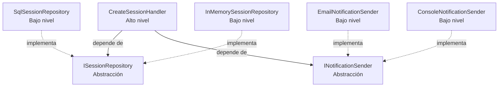

# Infraestructura (Implementaciones Concretas)

Esta carpeta contiene las **implementaciones concretas** de las abstracciones definidas en la carpeta `Abstractions/`.

## Propósito educativo

Estas clases de infraestructura:

- **Implementan** las interfaces (abstracciones)
- **Dependen** de las abstracciones (no al revés)
- **NO son conocidas** directamente por `CreateSessionHandler`

## Contenido

### Implementaciones de `ISessionRepository`

#### `SqlSessionRepository.cs` (Producción)

- Implementación para persistencia en SQL Server
- Registrada en el contenedor DI: `services.AddScoped<ISessionRepository, SqlSessionRepository>()`
- Usa lógica específica de SQL (simulada en el ejemplo)

#### `InMemorySessionRepository.cs` (Pruebas)

- Implementación en memoria usando `List<Session>`
- Perfecta para pruebas unitarias (rápida, sin I/O)
- Inyectable en lugar de `SqlSessionRepository` sin cambiar el handler

### Implementaciones de `INotificationSender`

#### `EmailNotificationSender.cs` (Producción)

- Implementación para envío de correo electrónico vía SMTP
- Simulada en el ejemplo con `Console.WriteLine`

#### `ConsoleNotificationSender.cs` (Desarrollo/Pruebas)

- Implementación que escribe en la consola
- Útil para desarrollo local y pruebas

## Inversión de Dependencia



**Nota clave:** Las flechas de dependencia apuntan **HACIA ADENTRO** (hacia abstracciones), no hacia afuera.

## Intercambiabilidad

Gracias a DIP, podemos cambiar implementaciones **sin modificar** `CreateSessionHandler`:

**Configuración de producción:**

```csharp
services.AddScoped<ISessionRepository, SqlSessionRepository>();
services.AddScoped<INotificationSender, EmailNotificationSender>();
```

**Configuración de pruebas:**

```csharp
var repository = new InMemorySessionRepository();
var notificationSender = new ConsoleNotificationSender();
var handler = new CreateSessionHandler(repository, notificationSender);
```

El handler **no cambia** — solo cambian las implementaciones inyectadas.
